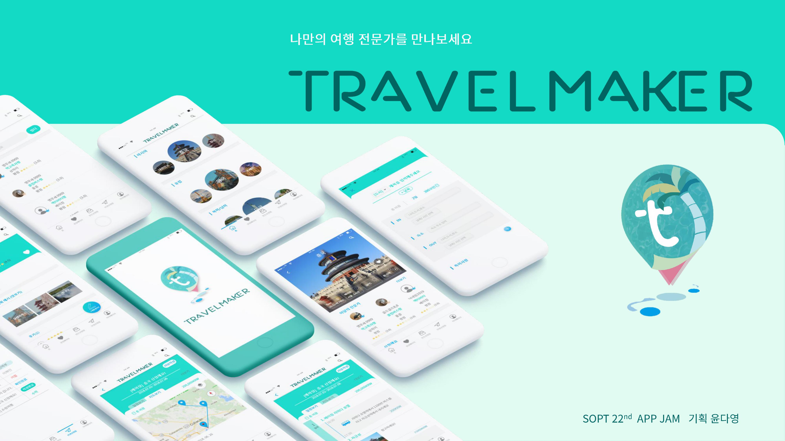

## TRAVEL MAKER

**나만의 여행 플랫폼** 

-누구나 초보자와 전문가가 되어 여행일정을 공유하는 서비스

-초보자는 원하는 나라와 일정을 양식에 맞춰 신청

-전문가는 초보자들의 신청을 보고 여행일정을 작성 

 -여행일정을 서로에게 메일형식으로 제공

## Team Travel Maker

**22기 SOPT APP JAM** - **Team Travel Maker**

개발기간: 2018.06 ~ 2018. 07

PM: 윤다영

TI: 김연주

디자인: 김정운, 나예슬

서버: 김현진, 한선민

IOS: 이충신, 조예은 

안드로이드: 장인규, 제갈윤, 심현준  

## 사용 기술 및 역할

- Kotlin
- Retrofit2, Gson 라이브러리 
- 뷰페이저, 카드뷰 등의 커스텀뷰 응용
- 2중, 3중 리싸이클러뷰 
- Google Map을 이용해서 나라별 위치 검색 및 좌표 기록